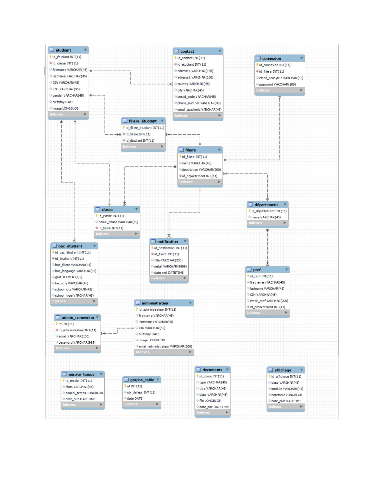
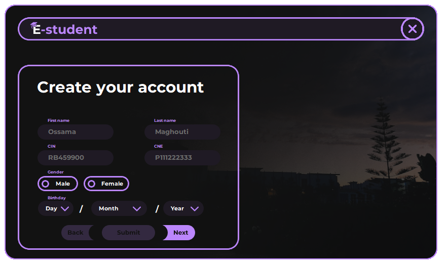
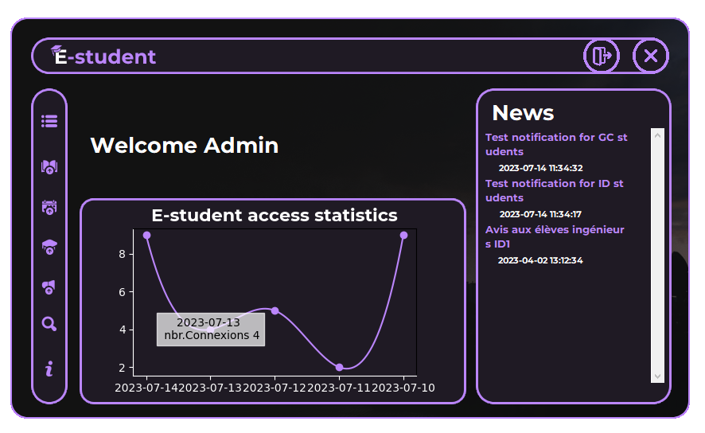
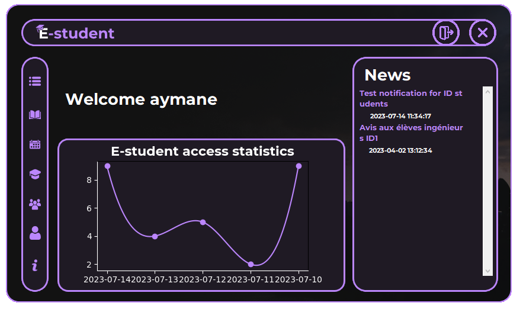
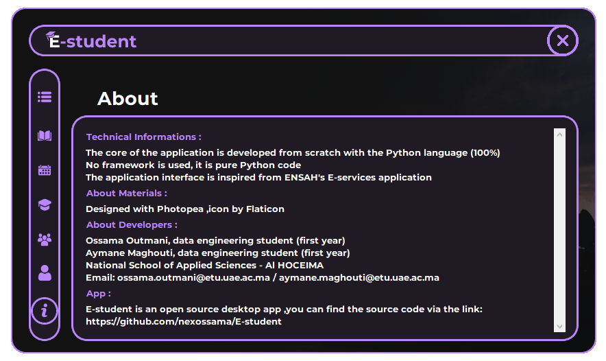

# Student Management System
---

# Table of Contents
---

- [Project Overview](#project-overview)
- [Features](#features)
- [Architecture](#architecture)
- [Prerequisites](#prerequisites)
- [Database Configuration](#database-configuration)
- [Running the Application](#running-the-application)
- [Usage](#usage)
- [About](#about)
- [Acknowledgments](#acknowledgments)

---

## Project Overview

This is a student management system project built using `Python` and the `Tkinter` library. The application allows students to register, access their personal profile, and download course materials. It also provides an admin space for administrators to manage files, view student information, and upload news. The system utilizes `MySQL` as the database management system and incorporates features such as image validation using `opencv` and visitor tracking. The application is build using  `PyCharm IDEA`.

---

---

## Features

`Student Registration` :student registration after providing the necessary information such as full name, email, image, ...

`Admin Space`: for File Management and News Updates

`Student Space`: for Accessing Course Materials and Personal Profile

`Notification System`: to keep the student up to date for any new news

`Visitor Tracking Graph` : to view the number of visitors per day

---

## Architecture

The application is built using Python and utilizes the Tkinter library for the graphical user interface (GUI). The MySQL database is used as the backend database management system. The system follows a client-server architecture, where the client is the user interface and the server is responsible for interacting with the database (works locally).

We tried to design a detailed architecture of our database in order to evaluate the performances during the `CRUD`  (Create-Read-Update-Delete) operations, and here is the result

---

## Prerequisites

Before running the application, make sure you have the following prerequisites:

`Python` 3.9.x installed 

`MySQL` database installed

The libraries should be installed are :

`contourpy` 
`cycler` 
`fonttools`
`kiwisolver`
`matplotlib`
`mysql-connector`
`numpy`
`opencv-python`
`packaging`
`Pillow`
`pyparsing`
`python-dateutil`
`scipy`

Note that if you want to install all this labreris in one click, you just need to execute this command as it is shown [here](#running-the-application)

---

## Database Configuration

To configure the `MySQL database` connection, follow these steps:

Open the project in Pycharme (or just find the config.ini file).
Locate the configuration file named conf.ini in the project's client folder.
Open the conf.ini file and update the following properties with your MySQL database credentials:

`host` : Specify the host name (default: localhost).

`port` : Specify the port number (default: 3306).

`username` : Enter the MySQL username (default: root).

`password` : Enter the MySQL password (default:).

---

## Running the Application

Clone the repository:

`git clone git@github.com:aymane-maghouti/E-student.git`

Install the required dependencies:

`pip install -r requirements.txt`

you can run the application with two methods: 

`first method` : navigate to the client folder after activating the virtual environment and run the client.py script using the terminal.

`Second method`: using Pycharm IDEA run the clien.py manually.

---

## Usage

Upon launching the application, users will be prompted to either log in or register, depending on whether they are an admin or a student. During the registration process, students are required to provide their personal information, including an image of themselves for validation.

After logging in, users will be directed to their respective spaces, where they can perform various actions based on their roles and access levels.

Mainly there are four interface

#### Inerface 1 : `Login`

#### Inerface 2 : `Registration`

#### Inerface 3 : `Admin space`

It should be noted that to consult the admin space, you must provide the following email and password:

`Email`: admin2023@gmail.com

`Password`: Admin1234

#### Inerface 4 : `Student space`

If you want to see how it's work, check the linkedin post where there is a vedio explain how to use it, here it is the link of the post [https://www.linkedin.com/oussama]
or this one :
[https://www.linkedin.com/aymane]

---

## About : 
Here is other information on the application and the developers :

---

## Acknowledgments
We would like to express our gratitude to the following resources for their valuable contributions to this project:

The official documentation of `Python` language.
The documentation provided by `MySQL` for configuring and working with the database.
The `Tkinter` documentation, which aided in creating the graphical user interface.
`flaticon.com` for providing icons.
`Photopia`  for the application's design

Feel free to customize the content and functionality of this application according to your specific requirements.
